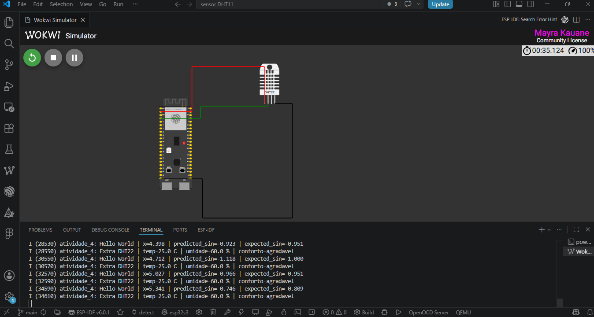

# Atividade Prática 4/6 - TensorFlow Lite Micro no ESP32-S3

Projeto desenvolvido para reproduzir o **Hello World do TensorFlow Lite Micro** no ESP32-S3 e implementar uma aplicação extra com sensor e dataset.
A implementação deste projeto foi feita na base local já existente com ESP32-S3, Wokwi e DHT22.

## Print da simulação



## O que o firmware faz

1. Inicializa o TensorFlow Lite Micro no ESP32-S3.
2. Carrega o modelo Hello World embarcado em `main/model.cc`.
3. Executa inferências para prever `sin(x)`.
4. Lê temperatura e umidade do DHT22 no Wokwi.
5. Usa um modelo leve de conforto térmico gerado a partir do dataset local.
6. Mostra no terminal serial tanto o resultado do Hello World quanto o extra.

Exemplo de saída:

```text
I (...) atividade_4: Hello World | x=3.456 | predicted_sin=-0.322 | expected_sin=-0.309
I (...) atividade_4: Extra DHT22 | temp=25.0 C | umidade=60.0 % | conforto=agradavel
```

## Arquivos principais

- `main/atividade_main.cc`: aplicação principal em C++.
- `main/model.cc`: modelo Hello World convertido para array C/C++.
- `main/model.h`: declaração do modelo TFLite embarcado.
- `main/generated/comfort_model.h`: modelo leve do extra gerado a partir do CSV.
- `data/dht_comfort_dataset.csv`: dataset do extra.
- `scripts/train_models.py`: lê o dataset, treina o modelo leve do extra e gera métricas.
- `scripts/calcular_centroides_dataset.py`: atalho para o mesmo fluxo de geração.
- `models/comfort_model.json`: descrição do modelo gerado para o extra.
- `models/metrics.json`: métricas do modelo do extra.
- `diagram.json`: circuito do Wokwi.
- `wokwi.toml`: configuração do Wokwi.
- `docs/relatorio.md`: análise e observações da atividade.

## Passos reproduzidos do Hello World

O notebook da aula descreve o fluxo:

1. Gerar amostras `x` no intervalo `[0, 2*pi]`.
2. Calcular `y = sin(x)`.
3. Treinar uma rede neural pequena.
4. Converter o modelo para TensorFlow Lite.
5. Quantizar o modelo para `int8`.
6. Converter o `.tflite` para array C/C++.
7. Executar a inferência no microcontrolador com TensorFlow Lite Micro.

No firmware, a entrada `x` é quantizada com `scale` e `zero_point`, enviada ao modelo, e a saída é dequantizada para `float`.

## Extra

A aplicação extra usa:

- **Sensor**: DHT22 no Wokwi.
- **Entrada**: temperatura e umidade.
- **Dataset**: `data/dht_comfort_dataset.csv`.
- **Saída**: classe de conforto térmico: `frio`, `agradavel` ou `quente`.

O script abaixo calcula os centroides do dataset e atualiza o arquivo usado pelo firmware:

```powershell
python scripts\train_models.py
```

Esse script gera:

```text
models/comfort_model.json
models/metrics.json
main/generated/comfort_model.h
```

Métrica atual do modelo do extra:

```text
Acurácia no dataset: 100% (22/22 amostras)
Classes: frio, agradavel, quente
```

Esse extra não é outro exemplo pronto do `esp-tflite-micro`. Ele modifica o projeto para usar um sensor físico/simulado, um dataset próprio e um artefato de modelo gerado a partir desse dataset.

## Como compilar

No terminal ESP-IDF:

```powershell
idf.py set-target esp32s3
idf.py build
```

Arquivos esperados:

```text
build/atividade_tflite_dht22.bin
build/atividade_tflite_dht22.elf
build/flasher_args.json
```

## Como simular no Wokwi

1. Compile o projeto com `idf.py build`.
2. Abra `diagram.json`.
3. Inicie a simulação pelo Wokwi.
4. Confira o terminal com as linhas `Hello World` e `Extra DHT22`.
5. Tire o print da tela com circuito e terminal serial.

## Observação sobre o desenho do circuito

O DHT22 usa três conexões:

- `3V3` para `VCC`, fio vermelho.
- `GND` para `GND`, fio preto.
- `GPIO4` para `SDA`, fio verde.

O terminal serial é conectado pelos pinos padrão `TX` e `RX` da placa no Wokwi.
