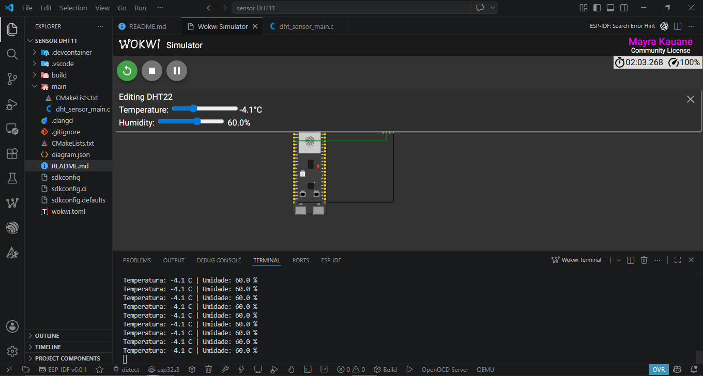
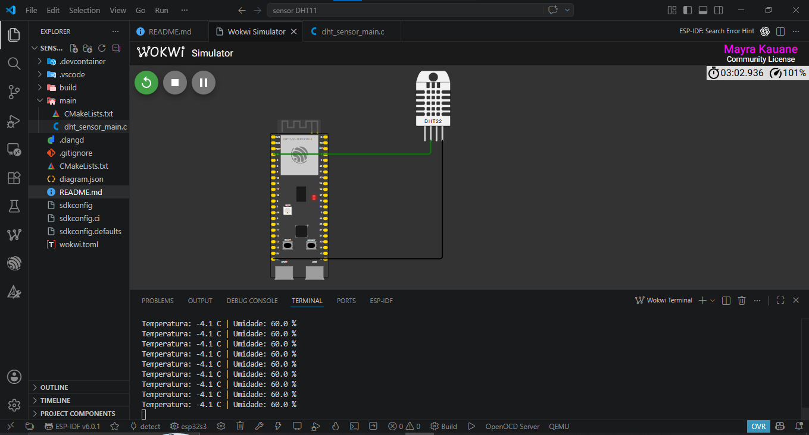
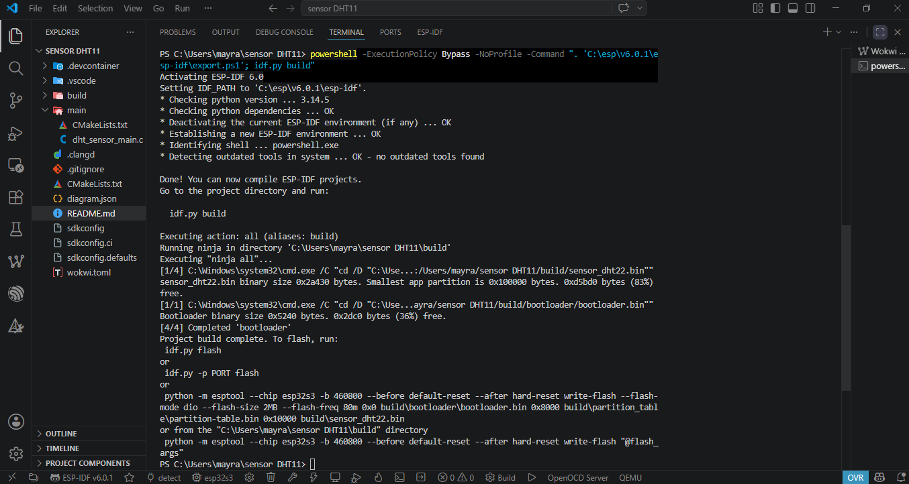

# Leitura de sensor DHT22 com ESP32-S3

Projeto em C com ESP-IDF para ler temperatura e umidade de um sensor DHT22 simulado no Wokwi e imprimir os valores no monitor serial.

## Hardware simulado

- Placa: ESP32-S3 DevKitC-1
- Sensor: DHT22
- Alimentacao: 3V3 e GND
- Dados: GPIO4
- Monitor serial Wokwi: UART1 em GPIO17/TX e GPIO18/RX

O circuito esta definido em `diagram.json`:

- `esp:3V3` -> `dht1:VCC`
- `esp:GND.1` -> `dht1:GND`
- `esp:4` -> `dht1:SDA`
- `esp:17` -> `$serialMonitor:RX`
- `esp:18` -> `$serialMonitor:TX`

## Arquivos principais

- `main/dht_sensor_main.c`: codigo da aplicacao em C
- `main/CMakeLists.txt`: dependencias do componente principal
- `diagram.json`: circuito usado pela simulacao do Wokwi
- `wokwi.toml`: aponta para `build/flasher_args.json`, que carrega bootloader, tabela de particoes e aplicacao no Wokwi

## Como compilar

No terminal do ESP-IDF:

```powershell
idf.py set-target esp32s3
idf.py build
```

O build deve gerar:

- `build/sensor_dht22.bin`
- `build/sensor_dht22.elf`
- `build/flasher_args.json`

Depois de alterar o codigo, sempre rode `idf.py build` antes de iniciar a simulacao no Wokwi.

## Como simular no VS Code

1. Abra esta pasta no VS Code.
2. Confirme que a extensao ESP-IDF esta configurada.
3. Confirme que a extensao Wokwi esta conectada a sua conta.
4. Compile com `idf.py build`.
5. Pare a simulacao, se ela ja estiver aberta.
6. Inicie novamente a simulacao pela extensao Wokwi.
7. Abra o painel `Wokwi Terminal` e tire o screenshot com leituras parecidas com:

```text
Leitura de sensor DHT22 no ESP32-S3
Pino de dados: GPIO4
Monitor serial: UART1 TX=GPIO17 RX=GPIO18 @ 115200 baud

Temperatura: 25.0 C | Umidade: 60.0 %
Temperatura: 25.0 C | Umidade: 60.0 %
```

Se o `Wokwi Terminal` ficar vazio, pare a simulacao, confirme que `wokwi.toml` usa `firmware = "build/flasher_args.json"`, rode `idf.py build`, feche a aba Wokwi Simulator e inicie a simulacao de novo.

## Checklist da entrega

- Configuracao do ESP-IDF e conta Wokwi
- Circuito no Wokwi com ESP32-S3 + DHT22
- Codigo compilando sem erros
- Monitor serial mostrando temperatura e umidade
- Link do repositorio Git com este codigo
- Screenshot da simulacao e do monitor serial

## Prints recomendados

- VS Code com ESP-IDF configurado e projeto aberto
- Wokwi Simulator mostrando ESP32-S3 conectado ao DHT22
- Terminal do build mostrando `Project build complete`
- Wokwi Terminal mostrando as leituras de temperatura e umidade

## Evidencias

### Circuito no Wokwi



### Monitor serial com leituras



### Codigo compilando sem erros


